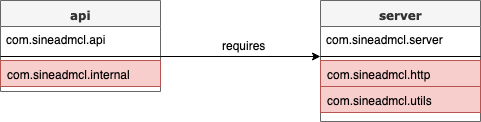

### Understanding Modules
Large codebases tend to run into 2 fundamental problems; encapsulating code and explicit dependencies between different parts of the system. 
Every public class can be acccessed by any other public classes on the classpath, which leads to the inadvertent usage of classes that were not intended to be part of the public API. 
As for the classpath, how do you know if all the required dependencies are there or if there are duplicate entries?

Modular JAR files contain an additional module descriptor. 
In this module descriptor, dependencies on other modules are expressed through __requires__ statements. 
Additionally, __exports__ statements control which packages are accessible to other modules. 
All non-exported packages are encapsulated in the module by default. 
Here's an example of a module descriptor, which lives in `module-info.java`:

```java
module api {
  exports com.sineadmcl.api;

  requires server;
}
```


Note that both modules contain packages that are encapsulated because they're not exported (visualized in red). 
Nobody can accidentally use classes from those packages. 

The Java platform itself has been modularized using its own module system as well. 
The two main advantages of the modular system are:
1. Strong encapsulation: You can control which of your packages are accessible, and you don't have to worry about maintaining code that you didn't intend for public consumption.
2. Reliable configuration: You avoid common class path problems such as duplicate or missing classes.

| [Previous](../../README.md) | [Next](describe_the_modular_jdk​.md) |
| :--------- | ----------: | 