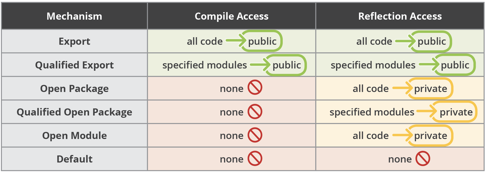

### Declare modules and enable access between modules

A module is simply a collection of packages. And like a package, its name is made up of letters, digits, underscores, and periods e.g `java.sql`

The package names within the module do not need to be related either. 
For example, the module `java.sql` contains packages `java.sql`, `javax.sql` and `javax.transaction.xa`

#### Module Declaration
To declare a module you place a file name `module-info.java` in the base directory (that is, the same directory that contains the `com` directory).

The `module-info.java` file contains the module declaration:  

```java
module [module.name] {
}
```
> The module keyword, as well as keywords requires, exports, and so on, are “restricted keywords” that have a special meaning only in module declarations.

#### Requires
It is a design goal of the module system that modules are explicit about their requirements, so that virtual machines can ensure that all requirements are fulfilled before starting a program. 
The `requires` keyword is used to express what this modules requires in order to run.

Imagine in your application you want to use the `example.util.logging` package which resides in the `example.custom.logging` module. 
In this case you must explicitly request it

```java
module example.module {
    requires example.custom.logging;
}
```

In the example above, your module `example.module` has a *compile-time* and *runtime* dependency on `example.custom.logging`. 
Consequently, when the module system encounters such a clause during module resolution (the phase in which module
 descriptors are processed and dependencies are resolved) it searches the universe of observable modules 
 (the modules in the JDK and on the module path) and throws an error if it doesn't find the module.
 
[Code Example](/examples/requires_example) 
 
#### Requires static
A `requires static` clause expresses a dependency that is optional at run time. 
That means at compile time the module system behaves exactly as described above. 
At run time, on the other hand, it mostly ignores requires static clauses. 
If it encounters one, it __does not resolve it__. 
That means, if an observable module is only referenced with requires static, it does not make it into the module graph.

[Code Example](/examples/requires_static_example) 

> It is not allowed to have circular dependencies between modules. If module `A` requires moduleB, then module `B
>` cannot also require module `A`.

#### Requires transitive

Specifying a module as required in the `module-info.java` does not automatically mean that users of your module will 
also acquire the specified modules transitive dependencies. e.g based on the `module-info.java` declaration above, 
`example.module` requires `example.custom.logging`. And lets say that the module declaration of `example.custom.logging` 
requires `java.logging`. Users of your module will not acquire `java.logging` as a transitive dependency.  

In order for you module to automatically provide the required module `java.logging` the `example.custom.logging` module 
should be declared as `requires transitive`

```java
module example.module {
    requires transitive example.custom.logging;
}
```

> It is recommended to use `requires transitive` when a package from another module is used in the public API but this is not a rule

#### Exports

By default, a module doesn't expose any of its API to other modules. 
It must state which of its packages are accessible using the `exports` keyword. 
For example the `example.module` used above exports a package called `example.client.api`

```java
module example.module {
    requires transitive example.custom.logging;
    
    exports example.client.api;
}
```

> You define module name with `requires` directive.
>
> You define package name with `exports` directive.

##### Modules and Reflective Access

In the modular world, you are no longer able to access a private member of any class using reflection. 
If a class is inside a module, reflective access to non-public members will fail

#### Open directive

Because the modular system enforces *strong encapsulation*, 
__we now have to explicitly grant permission for other modules to reflect on our classes__.

```java
open module example.module {
}
```

#### Opens directive

If we need to allow reflection of private types, but we don't want all of our code exposed, 
__we can use the *opens* directive to expose specific packages__.

```java
module example.module {
    requires transitive example.custom.logging;
    
    exports example.client.api;
    opens example.client.api.internal;
}
```

#### Opens ... to directive
`opens to` provides a way of narrowing the scope of exposure to a specified set of modules. 

```java
module example.module {
    requires transitive example.custom.logging;
    
    exports example.client.api;
    opens example.client.api.internal to module1, module2, etc;
}
```

Modules visibility summary
 
[Reference 7](../bibliography.md)